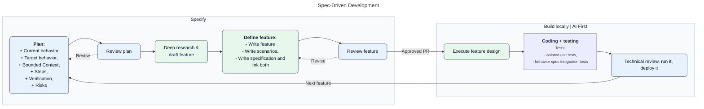

## Spec-Driven Development (SDD)

```mermaid
---
title: Spec-Driven Development
---
flowchart LR
    %% Phase Headers
    subgraph SpecifyPhase["Specify"]
        direction TB
        Plan["<b>Plan:</b> <br/> + Current behavior <br/> + Target behavior, <br/> + Bounded Context, <br/> + Steps, <br/> + Verification, <br/> + Risks"]:::humanNode
        ReviewPlan["Review plan"]:::humanNode
        DraftFeature["Deep research &<br/>draft feature"]:::agentNode
        SpecFile["<b>Define feature:</b><br/>- Write feature<br/>- Write scenarios,<br/> - Write specification and link both"]:::agentNode
        ReviewFeature["Review feature"]:::humanNode
    end

    subgraph BuildPhase["Build locally | AI First"]
        direction TB
        CodeTests["<b>Coding + testing</b><br/><small>Tests: <br/>- isolated unit tests, <br/>- behavior spec integration tests</small>"]:::artifactNodee
        ReviewShip["Technical review, run it, deploy it"]:::humanNode
        Execute["Execute feature design"]:::agentNode
    end

    %% Specify Phase Connections
    Plan --> ReviewPlan
    ReviewPlan --> DraftFeature
    ReviewPlan -. "Revise" .-> Plan
    DraftFeature --> SpecFile
    SpecFile --> ReviewFeature
    ReviewFeature -. "Revise" .-> SpecFile

    %% Phase Transition & Build Connections
    ReviewFeature -- "Approved PR" --> Execute
    Execute --> CodeTests
    CodeTests --> ReviewShip

    %% Iteration Loop
    ReviewShip -- "Next feature" --> Plan

    %% Styling matching the diagram's soft pastel palette
    classDef humanNode fill:#e8f2fc,stroke:#64748b,stroke-width:1.5px,color:#0f172a,rx:8,ry:8;
    classDef artifactNode fill:#ffffff,stroke:#64748b,stroke-width:1.5px,color:#0f172a,rx:8,ry:8;
    classDef agentNode fill:#e8f7ec,stroke:#64748b,stroke-width:1.5px,color:#0f172a,rx:8,ry:8;

    style SpecifyPhase fill:#f8fafc,stroke:#cbd5e1,stroke-width:1.5px,color:#0f172a
    style BuildPhase fill:#f8fafc,stroke:#cbd5e1,stroke-width:1.5px,color:#0f172a
```
